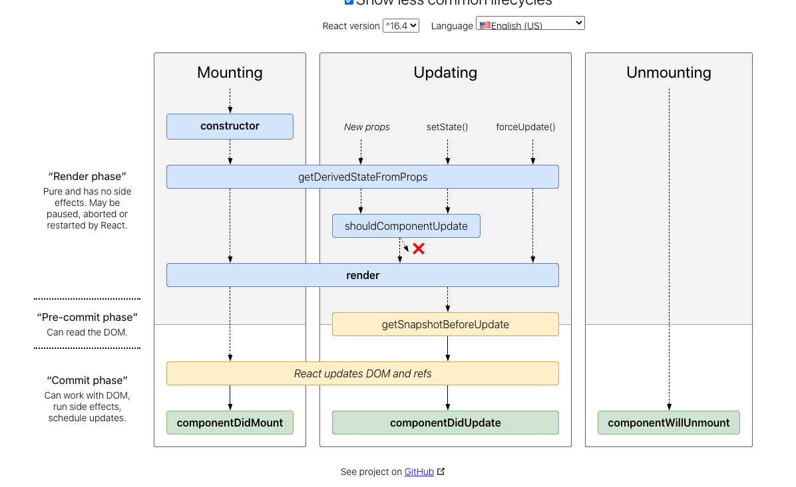

# 组件的生命周期
## 挂载阶段
- constructor()
- static getDerivedStateFromProps()
- render()
- componentDidMount()
>过时的：
>- UNSAFE_componentWillMount()

## 更新阶段
组件的props或state发生变化时会触发更新
- static getDerivedStateFromProps()
- shouldComponentUpdate()
- render()
- getSnapshotBeforeUpdate()
- componentDidUpdate()
> 过时的：
>- UNSAFE_componentWillMount()
>- UNSAFE_componentWillUpdate()
>- UNSAFE_componentWillReceiveProps()

## 卸载
- componentWillUnmount()

## 错误处理
- static getDerivedStateFromError()
- componentDidCatch()



## constructor
- 通过给 this.state 赋值对象来初始化内部 state。
- 为事件处理函数绑定实例

## getDerivedStateFromProps(props, state)
会在调用 render 方法之前调用，并且在初始挂载及后续更新时都会被调用。它应返回一个对象来更新 state，如果返回 null 则不更新任何内容
- 每次渲染前都会触发
- 可以用好memoization代替（写在render里面）

## render
class组件中唯一必须实现的方法，必须是纯函数
**如果 shouldComponentUpdate() 返回 false，则不会调用 render()**

## componentDidMount
组件挂载后（插入 DOM 树中）立即调用，在这里发请求。componentWillMount在fiber情况下可能会执行多次，
而且WillMount和Didmount之间间隔不了多久，微乎其微

## shouldComponentUpdate(nextProps, nextState)
考虑使用内置的 PureComponent 组件
***请注意，返回 false 并不会阻止子组件在 state 更改时重新渲染***

## getSnapshotBeforeUpdate(prevProps, prevState)
此生命周期的任何返回值将作为参数传递给 componentDidUpdate()

## componentDidUpdate(prevProps, prevState, snapshot)
更新后立即被调用，首次渲染不调用
```
componentDidUpdate(prevProps) {
  // 典型用法（不要忘记比较 props）：
  if (this.props.userID !== prevProps.userID) {
    this.fetchData(this.props.userID);
  }
}
```
可以在里面调用setState方法，但要加上条件判断，否则导致死循环

## componentWillUnmount
omponentWillUnmount() 会在组件卸载及销毁之前直接调用
清除 timer，取消网络请求或清除在 componentDidMount() 中创建的订阅

## 过时的生命周期方法
通病：异步渲染的情况下可能会执行多次
### UNSAFE_componentWillMount
组件的渲染可能会被中断,这时候不会执行comonentWillUnMount。只有执行了componentDidMount的情况下，才一定执行componentWillUnMount
### UNSAFE_componentWillUpdate
被调用很多次，只更新一次。把setState放在componentDidUpdate，能保证每次更新只调用一次
### UNSAFE_componentWillReceiveProps
如果在里面调用了父组件的方法，父组件的那个方法调用了setState，会导致死循环

